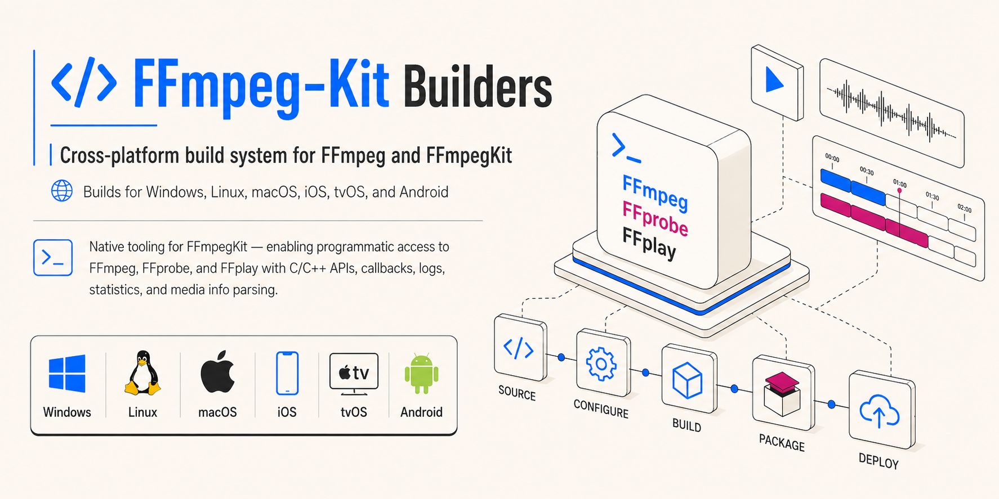

<div align="center">



[](https://github.com/akashskypatel/ffmpeg-kit-builders/stargazers) [](https://github.com/akashskypatel/ffmpeg-kit-builders/watchers) [](https://github.com/akashskypatel/ffmpeg-kit-builders/fork) [](https://github.com/akashskypatel/ffmpeg-kit-builders/issues) [](https://github.com/akashskypatel/ffmpeg-kit-builders/commits) [](https://github.com/akashskypatel/ffmpeg-kit-builders/releases) [](https://github.com/akashskypatel/ffmpeg-kit-builders/releases) [](LICENSE)

</div>

# FFmpeg-Kit Extended

FFmpeg-Kit Extended is a native library that allows programmatic access to executing FFmpeg, FFprobe, and FFplay commands for iOS, macOS, Android, Windows, and Linux. It provides a simple C and C++ API to execute these commands with callbacks for logs, statistics, session completion, media information parsing and more. The pure C API makes it easy to integrate with any language.

If you like the project and are using it in your app give it a ⭐ on GitHub and a 👍 on [pub.dev](https://pub.dev/packages/ffmpeg_kit_extended_flutter). It helps a lot 🙏! Happy coding 🚀!

# FFmpeg-Kit Builders

Cross-platform build system for FFmpeg and FFmpegKit supporting Windows, Linux, MacOS, iOS, and Android platforms.

## Features

- **Latest FFmpeg API** - [Uses the latest FFmpeg API v8.1.2](https://www.ffmpeg.org/download.html#release_8.1).
- **Both C++ and Pure C API** - Provides both C++ and pure C api to make it easy to use in any language.
- **FFmpeg, FFprobe, and FFplay** - Full FFmpeg, FFprobe, and FFplay support.
- **Asynchronous Execution** - Run long-running tasks without blocking the main thread.
- **Parallel Execution** - Run multiple tasks in parallel.
- **Callback Support** - Detailed hooks for logs, statistics, and session completion.
- **Extensible** - Designed to allow custom native library loading and configuration.
- **Deploy Custom Builds** - You can deploy custom builds of ffmpeg-kit-extended.
- **Cross-Platform Support** - Works on Windows, Linux, MacOS, iOS, and Android!

## Overview

This repository provides a comprehensive build system for FFmpeg and FFmpegKit that supports multiple platforms and architectures. The system handles the complete build pipeline from toolchain installation through dependency compilation to final bundle creation, with support for both native Linux builds and cross-compilation to Windows from Linux hosts, native MacOS build, cross-compilation to iOS on MacOS host, and cross-compilation to Android on Linux host.

## Platform Support

- **Linux**: Native builds for x86_64 architecture with shared libraries (.so) and static libraries (.a).
- **Windows**: Cross-compilation from Linux hosts using MinGW-w64 toolchain with shared libraries (.dll) and static mingw libraries (.a).
  - *Note: Compiling using MSVC ABI is not supported by the build script.*
- **Apple**: MacOS and iOS build scripts must be run on a MacOS to.
  - **iOS**: iOS-Simulator (arm64) fully supported to deploy on simulator builds.

| Platform                 | Status      | Architecture                                        | Min Version |
| ------------------------ | ----------- | --------------------------------------------------- | ----------- |
| Android (and Android-TV) | ✅ Supported | armv7 (arm-v7a), arm64 (aarch64, arm64-v8a), x86_64 | 26+         |
| iOS (and Simulator)      | ✅ Supported | arm64 (aarch64)                                     | 13+         |
| macOS                    | ✅ Supported | x86_64 and arm64 (aarch64)                          | 13+         |
| Linux                    | ✅ Supported | x86_64                                              | glibc 2.28+ |
| Windows                  | ✅ Supported | x86_64                                              | Windows 8+  |
| tvOS                     | Coming Soon | arm64 (aarch64)                                     |             |

## Quick Start

### Prerequisites

- **OS**: Linux host or WSL2 ([manylinux](https://quay.io/organization/pypa) recommended for maximum compatibility - use docker/devcontainer if unsure).
- **RAM**: 8GB+ recommended for linking static binaries.
- **Disk Space**: ~285GB available disk space for a full build with all dependencies and intermediate object files.
- **Custom Build**: bundle build sequence has already been organized in a way that accounts for dependencey tree. I have done my best to include dependencies in individual build steps but if you make a custom build with custom components enables/disabled you may run into dependency issues. You will have to troubleshoot those on your own.
- **Dependencies**: you will need the following dependencies:

```bash
# Run as root/sudo
# update
apt-get update
# install deps
apt-get install -qq --no-install-recommends ragel pkg-config make autoconf automake yasm cvs flex bison texinfo ed pax unzip patch wget xz-utils nasm gperf autogen bzip2 clang bc autopoint zstd curl git subversion libtool-bin build-essential cmake software-properties-common python3 coreutils python3-pip apt-transport-https ca-certificates python3-setuptools ninja-build autoconf-archive g++ gcc gettext help2man libtool p7zip-full python3-venv binutils llvm lld python3-numpy cython3 shellcheck xutils-dev libssl-dev zlib1g-dev libglib2.0-dev libglib2.0-dev-bin libgtkmm-3.0-dev libsdl2-dev
```

## Compiler Toolchain

### Windows (Cross-Compile)

Windows builds use the MinGW-w64 GCC 15.x toolchain. If running on a native Linux host (not a pre-configured Docker container), you **must** install the toolchain manually:

```bash
# Run as root/sudo
apt update && apt install binutils

# Download MinGW-w64 GCC 15
wget https://github.com/xpack-dev-tools/mingw-w64-gcc-xpack/releases/download/v15.2.0-2/xpack-mingw-w64-gcc-15.2.0-2-linux-x64.tar.gz
mkdir -p tools
tar xf xpack-mingw-w64-gcc-15.2.0-2-linux-x64.tar.gz -C tools
rm xpack-mingw-w64-gcc-15.2.0-2-linux-x64.tar.gz

# Install to /usr/local
mv tools/xpack-mingw-w64-gcc-15.2.0-2 /usr/local/mingw-w64
chown -R root:users /usr/local/mingw-w64
chmod -R 775 /usr/local/mingw-w64
```

### Rust Toolchain

Many modern multimedia libraries (rav1e, dovi_tool) require Rust.

```bash
# Run as root/sudo
curl --proto '=https' --tlsv1.2 -sSf https://sh.rustup.rs | sh -s -- -y --no-modify-path
source $HOME/.cargo/env

# Add Windows target for cross-compilation
rustup target add x86_64-pc-windows-gnu
# rustup target add i686-pc-windows-gnu # Uncomment for 32-bit builds

cargo install cargo-c
```

### Using the Unified Entry Point

The `runner.sh` script is the unified entry point for all builds. It can be used interactively or with explicit command-line options. Note that the script requires `sudo` privileges to install system packages and configure the build environment.

### Common Build Scenarios

```bash
# Interactive mode - prompts for platform and architecture
sudo ./runner.sh

# Non-interactive mode: Build GPL version with audio libraries for Linux x86_64
sudo ./runner.sh --host=linux --arch=x86_64 -y --enable-gpl --enable-audio

# Build for Linux with specific additional libraries
sudo ./runner.sh --host=linux --arch=x86_64 --enable-fontconfig --enable-freetype

# Force re-build for Linux (all libraries + FFmpegKit) with hardware acceleration
sudo ./runner.sh --host=linux --arch=x86_64 -f --video-hw-bundle

# Create a redistributable release zip
sudo ./runner.sh --host=linux --arch=x86_64 --full-bundle --release

# Force build Full non-free dependencies for windows 64 bit
sudo ./runner.sh --host=windows --arch=x86_64 --enable-full --enable-nonfree -y --build-deps-only -f

# Force build static Ffmpeg libraries and programs for windows 64 bit
sudo ./runner.sh --host=windows --arch=x86_64 --enable-full --enable-nonfree -y --build-ffmpeg-only=static -f --programs

# Force build shared Ffmpeg-kit library for windows 64 bit
sudo ./runner.sh --host=windows --arch=x86_64 --enable-full --enable-nonfree -y --build-ffmpeg-kit-only=shared -f

# resume previous failed run
sudo ./runner.sh --resume
```

## Architecture

The build system implements a modular architecture:

1. **Unified Entry Point**: `runner.sh` handles platform selection, argument parsing, and environment checks.
2. **Orchestration**: `scripts/main-linux.sh` and `scripts/main-windows.sh` coordinate the dependency tree.
3. **Execution Primitives**: `scripts/function.sh` contains the core logic for downloading, configuring, and compiling generic C/C++ projects.
4. **Library Recipes**: `scripts/run-linux.sh` and `scripts/run-windows.sh` contain specific build instructions for 100+ libraries.

## Output Structure

Artifacts are generated in the `prebuilt/` directory.

```text
prebuilt/
├── {platform}-{arch}/                                                     # e.g., linux-x86_64
│   ├── pkgconfig/                                                         # build script install manifest and other tracking files
│   ├── libraries
│   │       ├── include/                                                   # dependency Headers
│   │       ├── lib/                                                       # dependency .so/.dll/.a files
│   │       ├── bin/                                                       # dependency executables
│   │       ├── {other}/                                                   # other dependency aritfacts
│   ├── ffmpeg-kit-{features}-{platform}-{arch}-{type}-{license}/          # ffmpeg-kit build artifacts
│   │       ├── include/                                                   # Headers
│   │       ├── lib/                                                       # .so/.dll/.a files
│   │       ├── bin/                                                       # ffmpeg/ffprobe executables
│   │       ├── pkgconfig/                                                 # .pc files for linkage
│   │       └── licenses/                                                  # Extracted licenses
│   ├── ffmpeg-{features}-{platform}-{arch}-{type}-{license}/              # ffmpeg build artifacts
│   │       ├── include/                                                   # Headers
│   │       ├── lib/                                                       # .so/.dll/.a files
│   │       ├── bin/                                                       # ffmpeg/ffprobe executables
│   │       ├── pkgconfig/                                                 # .pc files for linkage
│   │       └── licenses/                                                  # Extracted licenses
│   ├── bundle-{features}-{platform}-{arch}-{type}-{license}/              # Unpacked Bundle
│   │       ├── include/                                                   # Headers
│   │       ├── lib/                                                       # .so/.dll/.a files
│   │       ├── bin/                                                       # ffmpeg/ffprobe executables
│   │       ├── pkgconfig/                                                 # .pc files for linkage
│   │       └── licenses/                                                  # Extracted licenses
│   └── releases/                     
│       └── bundle-{features}-{platform}-{arch}-{type}-{license}.zip       # Redistributable ZIP (if --release used)
```

## Build Phases

1. **Setup**: Initialize paths, environment variables (`CFLAGS`, `LDFLAGS`), and architecture settings.
2. **Toolchain**: Build or verify MinGW-w64 GCC 15+ toolchain (Windows targets only).
3. **Dependencies**: Compile enabled external libraries (e.g., x264, openssl, freetype) sequentially.
4. **FFmpeg**: Configure and build FFmpeg linking against the built dependencies.
5. **FFmpegKit**: Build the C++ wrapper library (`libffmpegkit`).
6. **Bundle**: Aggregate artifacts, fix paths in `pkg-config`, and collect licenses.

## Command-Line Options

### General & Platform

| Option                         | Description                                                                                                                                        |
| ------------------------------ | -------------------------------------------------------------------------------------------------------------------------------------------------- |
| `-h, --help`                   | Display help                                                                                                                                       |
| `-d, --debug`                  | Enable shell command tracing (`set -x`)                                                                                                            |
| `--debug-build\|--build-debug` | Build with debug symbols (`-g`) and no optimization                                                                                                |
| `-f, --force`                  | Force rebuild of all dependencies (cleans `already_built` flags)                                                                                   |
| `-y`                           | Non-interactive mode (accept defaults)                                                                                                             |
| `--release`                    | create release zip of ffmpeg-kit bundled binaries to be distributed                                                                                |
| `--release-and-clean`          | create release zip of ffmpeg-kit bundled binaries to be distributed and clean ffmpeg and ffmpeg-kit build artifacts (dependencies are not deleted) |
| `--host=*`                     | Target platform: `linux`, `windows`, `macos`, `ios`, `iphonesimulator`, `android`                                                                  |
| `--arch=*`                     | Target architecture: `x86_64`, `arm64`, `armv7`                                                                                                    |

### Licensing

| Option             | Description                                                                                                                          |
| ------------------ | ------------------------------------------------------------------------------------------------------------------------------------ |
| `--enable-gpl`     | Enables GPL libraries (x264, xvid, etc.). Resulting binary is **GPLv3**. Cannot be combined with `--enable-nonfree`.                 |
| `--enable-nonfree` | Enables non-free libraries (fdk-aac, decklink). Resulting binary is **Non-Redistributable**. Cannot be combined with `--enable-gpl`. |

### Feature presets

| Option                       | Description                                                                        |
| ---------------------------- | ---------------------------------------------------------------------------------- |
| `--enable-base`              | enable only base built-in ffmpeg libraries (cannot be combined with other presets) |
| `--enable-full`              | enable all available external libraries (based on gpl/non-gpl selection)           |
| `--enable-small`             | exclude certain extra libraries from presets to reduce size (see --list-excluded)  |
| `--enable-https`             | enable https libraries                                                             |
| `--enable-audio`             | enable all audio processing libraries                                              |
| `--enable-audio-ai`          | enable all audio processing ai libraries                                           |
| `--enable-video`             | enable all video processing libraries                                              |
| `--enable-video-streaming`   | enable all video streaming libraries                                               |
| `--enable-video-ai-cpu`      | enable all video ai cpu based libraries                                            |
| `--enable-video-ai-gpu`      | enable all video ai pick gpu based libraries                                       |
| `--enable-video-ai-gpu-cuda` | enable all video ai gpu cuda based libraries                                       |
| `--enable-video-ai-gpu-rocm` | enable all video ai gpu rocm based libraries                                       |
| `--enable-hardware`          | enable all hardware accel libraries                                                |
| `--enable-ssh`               | enable SSH/SFTP support                                                            |
| `--enable-smb`               | enable SMB (SAMBA) file sharing protocol support                                   |
| `--enable-mq`                | enable distributed systems support                                                 |

### Bundle presets

| Option                          | Description                                                                                               |
| ------------------------------- | --------------------------------------------------------------------------------------------------------- |
| `--audio-bundle`                | contains https + audio only libraries in the final bundle                                                 |
| `--audio-ai-bundle`             | contains https + audio + audio only ai libraries in the final bundle                                      |
| `--video-bundle`                | contains https + audio + video libraries in the final bundle                                              |
| `--video-ai-cpu-bundle`         | contains https + audio + video + ai (cpu) libraries in the final bundle                                   |
| `--video-ai-gpu-bundle`         | contains https + audio + video + ai (pick gpu interactive) libraries in the final bundle                  |
| `--video-ai-gpu-cuda-bundle`    | contains https + audio + video + ai (gpu:- cuda) libraries in the final bundle                            |
| `--video-ai-gpu-rocm-bundle`    | contains https + audio + video + ai (gpu:- rocm) libraries in the final bundle                            |
| `--video-hw-bundle`             | contains https + audio + video + hardware libraries in the final bundle                                   |
| `--video-hw-ai-cpu-bundle`      | contains https + audio + video + hardware + ai (cpu) libraries in the final bundle                        |
| `--video-hw-ai-gpu-bundle`      | contains https + audio + video + hardware + ai (pick gpu interactive) libraries in the final bundle       |
| `--video-hw-ai-gpu-cuda-bundle` | contains https + audio + video + hardware + ai (gpu:- cuda) libraries in the final bundle                 |
| `--video-hw-ai-gpu-rocm-bundle` | contains https + audio + video + hardware + ai (gpu:- rocm) libraries in the final bundle                 |
| `--streaming-bundle`            | contains https + audio + video + streaming libraries in the final bundle                                  |
| `--full-bundle`                 | contains https + audio + video + hardware + ai + streaming + ssh + smb + mq libraries in the final bundle |

### Build Options

| Option                                                          | Default                                     | Description                                                                                                                                                                                                                                     |
| --------------------------------------------------------------- | ------------------------------------------- | ----------------------------------------------------------------------------------------------------------------------------------------------------------------------------------------------------------------------------------------------- |
| `--ffmpeg-git-checkout-version=`                                | `release/8.1`                               | Build a particular version of FFmpeg (e.g., n3.1.1 or a specific git hash)                                                                                                                                                                      |
| `--ffmpeg-git-checkout=`                                        | `https://github.com/FFmpeg/FFmpeg.git`      | Clone FFmpeg from other repositories                                                                                                                                                                                                            |
| `--ffmpeg-source-dir=`                                          | `[empty]`                                   | Specify the directory of ffmpeg source code. When specified, git will not be used                                                                                                                                                               |
| `--cflags=`                                                     | `-mtune=generic -O3 -pipe`                  | Compiler flags (default works on any CPU)                                                                                                                                                                                                       |
| `--cxxflags=`                                                   | `-ffunction-sections -fdata-sections -fPIC` | Compiler flags (default works on any CPU)                                                                                                                                                                                                       |
| `--cppflags=`                                                   |                                             | Compiler flags (default works on any CPU)                                                                                                                                                                                                       |
| `--ldflags=`                                                    |                                             | Compiler flags (default works on any CPU)                                                                                                                                                                                                       |
| `--git-get-latest=`                                             | `y`                                         | Do a git pull for latest code from repositories like FFmpeg                                                                                                                                                                                     |
| `--prefer-stable=`                                              | `y`                                         | Build a few libraries from releases instead of git master                                                                                                                                                                                       |
| `--print-total-steps\|--print-all-steps`                        |                                             | print dependency steps and list all step names by index                                                                                                                                                                                         |
| `--build-only={0..} OR [library_name]`                          |                                             | Build only specific dependency (0.. or step/library name from get-all-steps)                                                                                                                                                                    |
| `--build-from={0..} OR [library_name]`                          |                                             | Start building dependencies from given step (0.. or step/library name)                                                                                                                                                                          |
| `--build-deps=[y]`                                              | `y`                                         | Whether or not to skip building dependencies                                                                                                                                                                                                    |
| `--build-deps-only`                                             |                                             | Only build dependency binaries. Will not build app binaries. (static or shared build only affects ffmpeg and ffmpeg-kit. Dependencies are always built statically.)                                                                             |
| `--build-ffmpeg-kit-only\|--kit\|--ffmpeg-kit=[shared]\|static` |                                             | build ffmpeg-kit library and bundle only of type [shared] or static. By default ffmpeg-kit always needs a static build of ffmpeg to be present already. Does not (re)build ext-library dependencies. Missing dependencies will cause a failure. |
| `--build-ffmpeg-only\|--ffmpeg=[shared]\|static`                |                                             | build ffmpeg binaries only of type [shared] or static. Does not (re)build ext-library dependencies. By default ffmpeg-kit always needs a static build of ffmpeg to be present already. Missing dependencies will cause a failure                |
| `--build-tests\|--test\|--tests`                                |                                             | Build tests. By default tests are not built.                                                                                                                                                                                                    |
| `--clean-builds=[shared]\|static`                               |                                             | clean ffmpeg and ffmpeg-kit builds of type [shared] or static and exit                                                                                                                                                                          |
| `--reset-and-clean(=ARG)`                                       |                                             | reset and clean all source directories of touch files and build artifacts. ARG=library src dir name                                                                                                                                             |
| `--list-libraries`                                              |                                             | Lists ffmpeg configuration including extra libraries and exit                                                                                                                                                                                   |
| `--enable-[library name]`                                       |                                             | Enable extra ffmpeg libraries. Run --list-libraries and see under "External library support"                                                                                                                                                    |
| `--ff-*`                                                        |                                             | Pass additional ffmpeg parameters prefixed by ff-* to ffmpeg configure. No additional checks done                                                                                                                                               |
| `--resume`                                                      |                                             | resume previously inturrupted run (based on ~run.state file)                                                                                                                                                                                    |

## Bundle Matrix

| Feature   | Base | Audio | Video | Video+Hardware | Full |
| --------- | ---- | ----- | ----- | -------------- | ---- |
| Video     |      |       | x     |                | x    |
| Audio     |      | x     | x     |                | x    |
| Streaming |      | x     | x     | x              | x    |
| Hardware  |      |       |       | x              | x    |
| AI*       |      |       |       |                |      |
| HTTPS     | *    | x     | x     | x              | x    |
| Platform* | x    | x     | x     | x              | x    |

1. AI features are not supported on all platforms. You must deploy your own custom build of ffmpeg-kit-extended to enable certain AI features.
   - See [Supported External Libraries](https://github.com/akashskypatel/ffmpeg-kit-builders?tab=readme-ov-file#supported-external-libraries) for more information.

3. Platform features are built-in platform libraries that FFmpeg support like AVFounation, VideoToolbox, etc. on apple platforms or DirectX, MediaFoundation on Windows.

4. HTTPS features are enabled by default for Platforms that have built-in HTTPS support like Windows or Apple. For Linux and Android OpenSSL is enabled by default.

## Bundle Contents by Platform

Shows which bundle first includes each library on Android, Linux, and Windows. `b+` = Base bundle and above. `a+` = Audio bundle and above. `v+` = Video bundle and above. `h+` = Video+Hardware bundle and above. `f` = Full bundle only. *(empty)* = not available on this platform.

### Filters

> **Windows**: `gfxcapture` is disabled due to MinGW compatibility issues.

### GPL licensing

> - Libraries marked <sup>[10](#gpl-info)</sup> are only compiled in when `--enable-gpl` is passed. Enabling any GPL library makes the resulting FFmpeg binary GPL-licensed and **non-redistributable under a permissive license**. Without `--enable-gpl`, those libraries are silently skipped even if their bundle is selected. The most impactful GPL libraries by bundle are:
>   - **Audio+**: libbs2b, libcdio, librubberband, libjack *(Linux)*
>   - **Video+**: libx264, libx265, libdavs2, libdvdnav, libdvdread, libxavs, libxavs2, libxvid *(Linux)*, frei0r, libvidstab
>   - **Video+HW+**: v4l2-m2m *(Linux)*
>   - **Video+ (Desktop only)**: avisynth

### AI

> **`libopenvino`**, and **`libtensorflow`** only available on Desktop builds (`MacOS`, `Linux`, and `Windows`). **`libtorch`** only available on `Linux` and `MacOs` builds (`Windows` not supported due ABI mismatch).


| Library                                                               | Android | Linux | Windows | iOS | macOS |
| --------------------------------------------------------------------- | ------- | ----- | ------- | --- | ----- |
| **System**                                                            |         |       |         |     |       |
| bzlib, iconv, lzma, zlib                                              | a+      | a+    | a+      | a+  | a+    |
| **TLS / HTTPS**<sup>[4](#https-info)</sup> *(one selected per build)* |         |       |         |     |       |
| openssl *(default)*, gnutls, mbedtls, libtls                          | a+      | a+    | a+      | a+  | a+    |
| schannel                                                              |         |       | a+      |     | a+    |
| **Streaming**                                                         |         |       |         |     |       |
| libsrt, librist, librtmp                                              | a+      | a+    | a+      | a+  | a+    |
| **Audio Codecs**                                                      |         |       |         |     |       |
| libcodec2, libgsm, libilbc, liblc3, libmodplug                        | a+      | a+    | a+      | a+  | a+    |
| libmp3lame, libopencore-amrnb, libopencore-amrwb                      | a+      | a+    | a+      | a+  | a+    |
| libopenmpt, libopus, libsoxr, libspeex, libtwolame                    | a+      | a+    | a+      | a+  | a+    |
| libvo-amrwbenc, libvorbis, openal                                     | a+      | a+    | a+      | a+  | a+    |
| alsa                                                                  |         | a+    |         |     |       |
| libbs2b<sup>[10](#gpl-info)</sup>                                     | a+      | a+    | a+      | a+  | a+    |
| **Audio Extras** *(not in `--small` builds)*                          |         |       |         |     |       |
| chromaprint, libflite, libgme, libmysofa, libshine, lv2               | a+      | a+    | a+      | a+  | a+    |
| libcdio, librubberband<sup>[10](#gpl-info)</sup>                      | a+      | a+    | a+      | a+  | a+    |
| ladspa, libpulse, sndio                                               |         | a+    |         |     |       |
| libjack<sup>[10](#gpl-info)</sup>                                     |         | a+    |         |     |       |
| **Video Libraries**                                                   |         |       |         |     |       |
| lcms2, libaom, libaribcaption                                         | v+      | v+    | v+      | v+  | v+    |
| libass, libbluray, libcaca, libdav1d                                  | v+      | v+    | v+      | v+  | v+    |
| libdav1d, libfontconfig, libfreetype, libfribidi                      | v+      | v+    | v+      | v+  | v+    |
| libharfbuzz, libjxl, libkvazaar, liblcevc-dec                         | v+      | v+    | v+      | v+  | v+    |
| liboapv, libopenh264, libopenjpeg, librav1e                           | v+      | v+    | v+      | v+  | v+    |
| librsvg, libsnappy, libsvtav1, libtheora,                             | v+      | v+    | v+      | v+  | v+    |
| libtheora, libuavs3d, libvpx, libvvenc, libwebp                       | v+      | v+    | v+      | v+  | v+    |
| libxevd, libxeve, libzimg, libzvbi, libxml2, sdl2                     | v+      | v+    | v+      | v+  | v+    |
| libdavs2, libdvdnav, libdvdread, libx264<sup>[10](#gpl-info)</sup>    | v+      | v+    | v+      | v+  | v+    |
| libx265, libxavs, libxavs2, libaribb24<sup>[10](#gpl-info)</sup>      | v+      | v+    | v+      | v+  | v+    |
| libdc1394, libiec61883                                                |         | v+    |         |     |       |
| libxvid<sup>[10](#gpl-info)</sup>                                     |         | v+    |         |     |       |
| **Video Extras** *(not in `--small` builds)*                          |         |       |         |     |       |
| libklvanc, liblensfun, libqrencode, libvmaf, vapoursynth              | v+      | v+    | v+      | v+  | v+    |
| frei0r, libvidstab<sup>[10](#gpl-info)</sup>                          | v+      | v+    | v+      | v+  | v+    |
| libv4l2, libxcb, libxcb-shape, libxcb-shm, libxcb-xfixes, xlib        |         | v+    |         |     |       |
| avisynth<sup>[10](#gpl-info)</sup>                                    |         | v+    | v+      |     | v+    |
| decklink<sup>[9](#nonfree-info)</sup> *(--enable-nonfree)*            | v+      | v+    | v+      | v+  | v+    |
| **Hardware Acceleration**                                             |         |       |         |     |       |
| amf, libglslang, libmfx, libplacebo, libshaderc, libvpl               | h+      | h+    | h+      | h+  | h+    |
| libnpp, opencl, opengl, vulkan, vulkan-static                         | h+      | h+    | h+      | h+  | h+    |
| ffnvcodec, cuvid, nvdec, nvenc<sup>[12](#redist-info)</sup>           |         | h+    | h+      |     |       |
| cuda-llvm, cuda-nvcc<sup>[12](#redist-info)</sup>                     |         | h+    | h+      |     |       |
| libdrm, vaapi, rkmpp, vdpau                                           |         | h+    |         |     |       |
| v4l2-m2m<sup>[10](#gpl-info)</sup>                                    |         | h+    |         |     |       |
| **AI** *(Full bundle only)*                                           |         |       |         |     |       |
| pocketsphinx, whisper                                                 | f       | f     | f       | f   | f     |
| libopencv, libquirc, libtesseract<sup>[11](#compute-info)</sup>       | f       | f     | f       | f   | f     |
| libopenvino, libtensorflow<sup>[11](#compute-info)</sup>              |         | f     | f       |     | f     |
| libtorch<sup>[11](#compute-info)</sup>                                |         | f     |         |     | f     |
| **Nonfree additions** *(Full + --enable-nonfree)*                     |         |       |         |     |       |
| libfdk-aac<sup>[9](#nonfree-info)</sup>                               | f       | f     | f       | f   | f     |
| **Platform-specific** *(All bundles)*                                 |         |       |         |     |       |
| jni, mediacodec                                                       | b+      |       |         |     |       |
| appkit, avfoundation, audiotoolbox, coreimage, metal, securetransport |         |       |         | b+  | b+    |
| videotoolbox, schannel, dxva2, d3d12va, d3d11va, mediafoundation      |         |       |         | b+  | b+    |
| appkit                                                                |         |       |         |     | b+    |
| schannel, dxva2, d3d12va, d3d11va, mediafoundation                    |         |       | b+      |     |       |
| alsa                                                                  |         | b+    |         |     |       |

## Supported External Libraries

You can also get the full list of supported external libraries by running `--list-libraries`

| Library                                      | Description                                             | Platform<sup>[1](#platform-info)</sup> | Extra<sup>[2](#extra-info)</sup> | Base | Audio              | Video              | Video+Hardware     | Full                |
| -------------------------------------------- | ------------------------------------------------------- | -------------------------------------- | -------------------------------- | ---- | ------------------ | ------------------ | ------------------ | ------------------- |
| jni<sup>[8](#install-info)</sup>             | Enables Java Native Interface interactions on Android   | Android                                |                                  | x    | x                  | x                  | x                  | x                   |
| appkit<sup>[8](#install-info)</sup>          | Accesses AppKit for screen and window capture           | Apple                                  |                                  | x    | [9](#nonfree-info) | [9](#nonfree-info) | [9](#nonfree-info) | [9](#nonfree-info)  |
| avfoundation<sup>[8](#install-info)</sup>    | Captures input from AVFoundation devices (cameras/mics) | Apple                                  |                                  | x    | [9](#nonfree-info) | [9](#nonfree-info) | [9](#nonfree-info) | [9](#nonfree-info)  |
| pocketsphinx                                 | Performs offline speech-to-text conversion              |                                        |                                  |      |                    |                    |                    | x                   |
| whisper                                      | Integrates OpenAI Whisper for speech recognition        |                                        |                                  |      |                    |                    |                    | x                   |
| audiotoolbox<sup>[8](#install-info)</sup>    | Accesses AudioToolbox for native codec support          | Apple                                  |                                  | x    | [9](#nonfree-info) | [9](#nonfree-info) | [9](#nonfree-info) | [9](#nonfree-info)  |
| alsa                                         | Accesses ALSA for audio input and output                | Linux                                  |                                  | x    | x                  | x                  | x                  | x                   |
| chromaprint                                  | Calculates audio fingerprints for identification        |                                        | x                                |      | x                  | x                  | x                  | x                   |
| ladspa                                       | Loads LADSPA plugins for audio filtering                | Linux                                  | x                                |      | x                  | x                  | x                  | x                   |
| libbs2b                                      | Simulates binaural audio via DSP                        |                                        |                                  |      | [10](#gpl-info)    | [10](#gpl-info)    | [10](#gpl-info)    | [10](#gpl-info)     |
| libcdio                                      | Reads and extracts audio from CDs                       |                                        | [10](#gpl-info)                  |      | [10](#gpl-info)    | [10](#gpl-info)    | [10](#gpl-info)    | [10](#gpl-info)     |
| libcelt<sup>[13](#deprecated-info)</sup>     | Decodes CELT audio streams                              |                                        |                                  |      |                    |                    |                    |                     |
| libcodec2                                    | Encodes and decodes Codec2 speech format                |                                        |                                  |      | x                  | x                  | x                  | x                   |
| libfdk-aac                                   | Encodes and decodes high-quality AAC audio              |                                        |                                  |      | [9](#nonfree-info) | [9](#nonfree-info) | [9](#nonfree-info) | [9](#nonfree-info)  |
| libflite                                     | Synthesizes speech from text (TTS) filter               |                                        | x                                |      | x                  | x                  | x                  | x                   |
| libgme                                       | Emulates and plays video game music formats             |                                        | x                                |      | x                  | x                  | x                  | x                   |
| libgsm                                       | Encodes and decodes GSM audio                           |                                        |                                  |      | x                  | x                  | x                  | x                   |
| libilbc                                      | Encodes and decodes iLBC audio                          |                                        |                                  |      | x                  | x                  | x                  | x                   |
| libjack<sup>[8](#install-info)</sup>         | Connects to the JACK audio connection kit               | Linux                                  | [10](#gpl-info)                  |      | [10](#gpl-info)    | [10](#gpl-info)    | [10](#gpl-info)    | [10](#gpl-info)     |
| liblc3                                       | Encodes and decodes LC3 (Bluetooth LE) audio            |                                        |                                  |      | x                  | x                  | x                  | x                   |
| libmodplug                                   | Decodes module music formats (MOD, etc.)                |                                        |                                  |      | x                  | x                  | x                  | x                   |
| libmp3lame                                   | Encodes MP3 audio                                       |                                        |                                  |      | x                  | x                  | x                  | x                   |
| libmysofa                                    | Reads HRTF files for the sofalizer filter               |                                        | x                                |      | x                  | x                  | x                  | x                   |
| libopencore-amrnb                            | Encodes and decodes AMR-NB audio                        |                                        |                                  |      | x                  | x                  | x                  | x                   |
| libopencore-amrwb                            | Decodes AMR-WB audio                                    |                                        |                                  |      | x                  | x                  | x                  | x                   |
| libopenmpt                                   | Decodes tracked music files (OpenMPT based)             |                                        |                                  |      | x                  | x                  | x                  | x                   |
| libopus                                      | Encodes and decodes Opus audio                          |                                        |                                  |      | x                  | x                  | x                  | x                   |
| libpulse<sup>[8](#install-info)</sup>        | Captures audio via PulseAudio server                    | Linux                                  | x                                |      | x                  | x                  | x                  | x                   |
| librubberband                                | Performs high-quality time stretching/pitch shifting    |                                        | [10](#gpl-info)                  |      | [10](#gpl-info)    | [10](#gpl-info)    | [10](#gpl-info)    | [10](#gpl-info)     |
| libshine                                     | Encodes MP3 using fixed-point math                      |                                        | x                                |      | x                  | x                  | x                  | x                   |
| libsoxr                                      | Resamples audio using the SoX library                   |                                        |                                  |      | x                  | x                  | x                  | x                   |
| libspeex                                     | Encodes and decodes Speex audio                         |                                        |                                  |      | x                  | x                  | x                  | x                   |
| libtwolame                                   | Encodes MP2 audio                                       |                                        |                                  |      | x                  | x                  | x                  | x                   |
| libvo-amrwbenc                               | Encodes AMR-WB audio                                    |                                        |                                  |      | x                  | x                  | x                  | x                   |
| libvorbis                                    | Encodes and decodes Vorbis audio                        |                                        |                                  |      | x                  | x                  | x                  | x                   |
| lv2                                          | Loads LV2 plugins for audio filtering                   |                                        | x                                |      | x                  | x                  | x                  | x                   |
| openal                                       | Captures audio via OpenAL 1.1                           |                                        |                                  |      | x                  | x                  | x                  | x                   |
| sndio                                        | Accesses sndio for audio I/O on OpenBSD                 | Linux                                  | x                                |      | x                  | x                  | x                  | x                   |
| gcrypt                                       | Provides crypto functions for RTMP/RTMPE                | [3](#rtmpte-info)                      |                                  |      |                    |                    |                    |                     |
| gmp                                          | Provides math functions for crypto contexts             | [3](#rtmpte-info)                      |                                  |      |                    |                    |                    |                     |
| bzlib                                        | Compresses and decompresses bzip2 streams               |                                        |                                  |      | x                  | x                  | x                  | x                   |
| iconv                                        | Converts character encodings for text/subtitles         |                                        |                                  |      | x                  | x                  | x                  | x                   |
| libxml2                                      | Parses XML for DASH, IMF, and other formats             |                                        |                                  |      |                    | x                  | x                  | x                   |
| lzma                                         | Provides LZMA lossless data compression                 |                                        |                                  |      | x                  | x                  | x                  | x                   |
| zlib                                         | Provides Deflate/zlib lossless data compression         |                                        |                                  |      | x                  | x                  | x                  | x                   |
| amf                                          | Accesses AMD Advanced Media Framework (GPU encoding)    |                                        |                                  |      |                    |                    | x                  | x                   |
| mediacodec<sup>[8](#install-info)</sup>      | Accesses Android MediaCodec hardware acceleration       | Android                                |                                  | x    |                    |                    | x                  | x                   |
| coreimage<sup>[8](#install-info)</sup>       | Applies video filters via Apple CoreImage               | Apple                                  |                                  | x    |                    |                    | [9](#nonfree-info) | [9](#nonfree-info)  |
| metal<sup>[8](#install-info)</sup>           | Utilizes Apple Metal for GPU acceleration               | Apple                                  |                                  | x    |                    |                    | [9](#nonfree-info) | [9](#nonfree-info)  |
| videotoolbox<sup>[8](#install-info)</sup>    | Accesses VideoToolbox for hardware encoding/decoding    | Apple                                  |                                  | x    |                    |                    | [9](#nonfree-info) | [9](#nonfree-info)  |
| cuda-llvm<sup>[8](#install-info)</sup>       | Compiles CUDA kernels at runtime using Clang            | Nvidia                                 |                                  |      |                    |                    | [12](#redist-info) | [12](#redist-info)  |
| cuda-nvcc<sup>[8](#install-info)</sup>       | Compiles CUDA kernels using NVCC                        | Nvidia                                 |                                  |      |                    |                    | [12](#redist-info) | [12](#redist-info)  |
| cuvid<sup>[8](#install-info)</sup>           | Accesses Nvidia CUVID for decoding (Legacy)             | Nvidia                                 |                                  |      |                    |                    | [12](#redist-info) | [12](#redist-info)  |
| ffnvcodec                                    | Provides headers for Nvidia codec API integration       | Nvidia                                 |                                  |      |                    |                    | [12](#redist-info) | [12](#redist-info)  |
| libdrm                                       | Accesses Direct Rendering Manager for Linux GPU buffer  | Linux                                  |                                  |      |                    |                    | x                  | x                   |
| libglslang<sup>[14](#conflict-info)</sup>    | Compiles GLSL shaders to SPIR-V for Vulkan filters      |                                        |                                  |      |                    |                    | x                  | x                   |
| libmfx<sup>[14](#conflict-info)</sup>        | Accesses Intel Quick Sync Video (QSV) via MediaSDK      |                                        |                                  |      |                    |                    | x                  | x                   |
| libnpp<sup>[13](#deprecated-info)</sup>      | Uses Nvidia Performance Primitives for image processing | Nvidia                                 |                                  |      |                    |                    |                    |                     |
| libplacebo                                   | Applies high-quality GPU video processing filters       |                                        |                                  |      |                    |                    | x                  | x                   |
| libshaderc<sup>[14](#conflict-info)</sup>    | Compiles GLSL shaders to SPIR-V (Google implementation) |                                        |                                  |      |                    |                    | x                  | x                   |
| libvpl<sup>[14](#conflict-info)</sup>        | Accesses Intel oneVPL video processing library          |                                        |                                  |      |                    |                    | x                  | x                   |
| nvdec<sup>[8](#install-info)</sup>           | Accesses Nvidia NVDEC for hardware decoding             | Nvidia                                 |                                  |      |                    |                    | [12](#redist-info) | [12](#redist-info)  |
| nvenc<sup>[8](#install-info)</sup>           | Accesses Nvidia NVENC for hardware encoding             | Nvidia                                 |                                  |      |                    |                    | [12](#redist-info) | [12](#redist-info)  |
| opencl                                       | Enables OpenCL-based video filtering                    |                                        |                                  |      |                    |                    | x                  | x                   |
| rkmpp                                        | Accesses Rockchip Media Process Platform for HW codecs  | Linux                                  |                                  |      |                    |                    | x                  | x                   |
| v4l2-m2m                                     | Accesses V4L2 Memory-to-Memory hardware codecs          | Linux                                  |                                  |      |                    |                    | [10](#gpl-info)    | [10](#gpl-info)     |
| vaapi                                        | Accesses Video Acceleration API for HW codecs           | Linux                                  |                                  |      |                    |                    | x                  | x                   |
| vdpau<sup>[8](#install-info)</sup>           | Accesses VDPAU for hardware decoding on Unix            | Linux+Nvidia                           |                                  |      |                    |                    | x                  | x                   |
| vulkan                                       | Enables Vulkan-based filtering and rendering            |                                        |                                  |      |                    |                    | x                  | x                   |
| vulkan-static                                | Links libvulkan statically                              |                                        |                                  |      |                    |                    | x                  | x                   |
| opengl                                       | Enables OpenGL-based rendering and filtering            |                                        |                                  |      |                    |                    | x                  | x                   |
| d3d11va<sup>[8](#install-info)</sup>         | Accesses Direct3D 11 for video acceleration             | Windows                                |                                  | x    |                    |                    | [9](#nonfree-info) | [9](#nonfree-info)  |
| d3d12va<sup>[8](#install-info)</sup>         | Accesses Direct3D 12 for video acceleration             | Windows                                |                                  | x    |                    |                    | [9](#nonfree-info) | [9](#nonfree-info)  |
| dxva2<sup>[8](#install-info)</sup>           | Accesses DirectX 9 for video acceleration               | Windows                                |                                  | x    |                    |                    | [9](#nonfree-info) | [9](#nonfree-info)  |
| mediafoundation<sup>[8](#install-info)</sup> | Accesses Windows Media Foundation for encoding          | Windows                                |                                  | x    |                    |                    | [9](#nonfree-info) | [9](#nonfree-info)  |
| ohcodec<sup>[8](#install-info)</sup>         | Accesses OpenHarmony multimedia codec capabilities      | HarmonyOS                              |                                  |      |                    |                    | [9](#nonfree-info) | [9](#nonfree-info)  |
| mmal                                         | Accesses Broadcom MMAL for Raspberry Pi multimedia      | Raspberry Pi                           |                                  |      |                    |                    | [9](#nonfree-info) | [9](#nonfree-info)  |
| omx                                          | Accesses OpenMAX IL for hardware acceleration           | Raspberry Pi                           |                                  |      |                    |                    | [9](#nonfree-info) | [9](#nonfree-info)  |
| omx-rpi                                      | Accesses OpenMAX IL implementation for Raspberry Pi     | Raspberry Pi                           |                                  |      |                    |                    | [9](#nonfree-info) | [9](#nonfree-info)  |
| securetransport<sup>[8](#install-info)</sup> | Provides TLS/SSL support via Apple Secure Transport     | Apple                                  |                                  | x    | [4](#https-info)   | [4](#https-info)   | [4](#https-info)   | [4](#https-info)    |
| gnutls                                       | Provides TLS/SSL support via GnuTLS                     |                                        |                                  |      | [4](#https-info)   | [4](#https-info)   | [4](#https-info)   | [4](#https-info)    |
| libtls                                       | Provides TLS/SSL support via LibreSSL                   |                                        |                                  |      | [4](#https-info)   | [4](#https-info)   | [4](#https-info)   | [4](#https-info)    |
| mbedtls                                      | Provides TLS/SSL support via mbedTLS                    |                                        |                                  |      | [4](#https-info)   | [4](#https-info)   | [4](#https-info)   | [4](#https-info)    |
| openssl                                      | Provides TLS/SSL support via OpenSSL                    |                                        |                                  |      | [4](#https-info)   | [4](#https-info)   | [4](#https-info)   | [4](#https-info)    |
| schannel<sup>[8](#install-info)</sup>        | Provides TLS/SSL support via Windows SChannel           | Windows                                |                                  | x    | [4](#https-info)   | [4](#https-info)   | [4](#https-info)   | [4](#https-info)    |
| librabbitmq                                  | Enables AMQP protocol support (RabbitMQ)                |                                        | [5](#mq-info)                    |      |                    |                    |                    |                     |
| libzmq                                       | Enables ZeroMQ message passing protocol                 |                                        | [5](#mq-info)                    |      |                    |                    |                    |                     |
| libsmbclient                                 | Enables SMB/CIFS protocol support                       |                                        | [6](#smb-info) & [10](#gpl-info) |      |                    |                    |                    |                     |
| libssh                                       | Enables SFTP protocol support                           |                                        | [7](#ssh-info)                   |      |                    |                    |                    |                     |
| librist                                      | Enables Reliable Internet Stream Transport (RIST)       |                                        |                                  |      | x                  | x                  | x                  | x                   |
| librtmp                                      | Enables RTMP and RTMPE stream support                   |                                        |                                  |      | x                  | x                  | x                  | x                   |
| libsrt                                       | Enables Secure Reliable Transport (SRT) protocol        |                                        |                                  |      | x                  | x                  | x                  | x                   |
| libopencv                                    | Applies computer vision filters via OpenCV              |                                        |                                  |      |                    |                    |                    | x                   |
| libopenvino<sup>[8](#install-info)</sup>     | Runs DNN-based filters using Intel OpenVINO backend     |                                        |                                  |      |                    |                    |                    | [11](#compute-info) |
| libtensorflow<sup>[8](#install-info)</sup>   | Runs DNN-based filters using TensorFlow backend         |                                        |                                  |      |                    |                    |                    | [11](#compute-info) |
| libtorch<sup>[8](#install-info)</sup>        | Runs DNN-based filters using PyTorch backend            |                                        |                                  |      |                    |                    |                    | [11](#compute-info) |
| libquirc                                     | Decodes QR codes from video streams                     |                                        |                                  |      |                    |                    |                    | x                   |
| libtesseract                                 | Performs Optical Character Recognition (OCR)            |                                        |                                  |      |                    |                    |                    | x                   |
| sdl2                                         | Outputs audio/video to window using SDL2                |                                        |                                  |      | x                  | x                  | x                  | x                   |
| avisynth                                     | Reads and demuxes AviSynth script files                 |                                        | [10](#gpl-info)                  |      |                    | [10](#gpl-info)    | [10](#gpl-info)    | [10](#gpl-info)     |
| decklink                                     | Captures/Outputs via Blackmagic DeckLink devices        |                                        |                                  |      |                    | [9](#nonfree-info) | [9](#nonfree-info) | [9](#nonfree-info)  |
| frei0r                                       | Loads Frei0r plugins for video filtering                |                                        | [10](#gpl-info)                  |      |                    | [10](#gpl-info)    | [10](#gpl-info)    | [10](#gpl-info)     |
| lcms2                                        | Applies ICC color profiles using LittleCMS 2            |                                        |                                  |      |                    | x                  | x                  | x                   |
| libaom                                       | Encodes and decodes AV1 video                           |                                        |                                  |      |                    | x                  | x                  | x                   |
| libaribb24                                   | Decodes ARIB STD-B24 captions                           |                                        |                                  |      |                    | x                  | x                  | x                   |
| libaribcaption                               | Decodes ARIB captions (alternative library)             |                                        |                                  |      |                    | x                  | x                  | x                   |
| libass                                       | Renders ASS/SSA subtitles                               |                                        |                                  |      |                    | x                  | x                  | x                   |
| libbluray                                    | Reads Blu-ray playlists and protocols                   |                                        |                                  |      |                    | x                  | x                  | x                   |
| libcaca                                      | Renders video as ASCII characters                       |                                        |                                  |      |                    | x                  | x                  | x                   |
| libdav1d                                     | Decodes AV1 video (high performance)                    |                                        |                                  |      |                    | x                  | x                  | x                   |
| libdavs2                                     | Decodes AVS2 video                                      |                                        |                                  |      |                    | [10](#gpl-info)    | [10](#gpl-info)    | [10](#gpl-info)     |
| libdc1394                                    | Captures video from FireWire cameras                    | Linux                                  |                                  |      |                    | x                  | x                  | x                   |
| libdvdnav                                    | Navigates and demuxes DVD menus/content                 |                                        |                                  |      |                    | [10](#gpl-info)    | [10](#gpl-info)    | [10](#gpl-info)     |
| libdvdread                                   | Reads DVD filesystem structures                         |                                        |                                  |      |                    | [10](#gpl-info)    | [10](#gpl-info)    | [10](#gpl-info)     |
| libfontconfig                                | Configures and locates fonts for text rendering         |                                        |                                  |      |                    | x                  | x                  | x                   |
| libfreetype                                  | Renders fonts for text overlays                         |                                        |                                  |      |                    | x                  | x                  | x                   |
| libfribidi                                   | Handles bi-directional text logic                       |                                        |                                  |      |                    | x                  | x                  | x                   |
| libharfbuzz                                  | Shapes complex text for subtitles                       |                                        |                                  |      |                    | x                  | x                  | x                   |
| libiec61883                                  | Captures DV/HDV via FireWire                            | Linux                                  |                                  |      |                    | x                  | x                  | x                   |
| libjxl                                       | Encodes and decodes JPEG XL images                      |                                        |                                  |      |                    | x                  | x                  | x                   |
| libklvanc                                    | Processes Vertical Ancillary Data (VANC)                |                                        | x                                |      |                    | x                  | x                  | x                   |
| libkvazaar                                   | Encodes HEVC video                                      |                                        |                                  |      |                    | x                  | x                  | x                   |
| liblcevc-dec                                 | Decodes LCEVC video enhancement layers                  |                                        |                                  |      |                    | x                  | x                  | x                   |
| liblensfun                                   | Corrects lens distortion using Lensfun                  |                                        | x                                |      |                    | x                  | x                  | x                   |
| liboapv                                      | Encodes OAPV (Open Advanced Photos/Video)               |                                        |                                  |      |                    | x                  | x                  | x                   |
| libopenh264                                  | Encodes H.264 video (Cisco implementation)              |                                        |                                  |      |                    | x                  | x                  | x                   |
| libopenjpeg                                  | Encodes and decodes JPEG 2000 images                    |                                        |                                  |      |                    | x                  | x                  | x                   |
| libqrencode                                  | Generates QR codes as video sources                     |                                        | x                                |      |                    | x                  | x                  | x                   |
| librav1e                                     | Encodes AV1 video (Rust implementation)                 |                                        |                                  |      |                    | x                  | x                  | x                   |
| librsvg                                      | Renders SVG files for overlays                          |                                        |                                  |      |                    | x                  | x                  | x                   |
| libsnappy                                    | Compresses data for the Hap codec                       |                                        |                                  |      |                    | x                  | x                  | x                   |
| libsvtav1                                    | Encodes AV1 video (SVT implementation)                  |                                        |                                  |      |                    | x                  | x                  | x                   |
| libtheora                                    | Encodes Theora video                                    |                                        |                                  |      |                    | x                  | x                  | x                   |
| libuavs3d                                    | Decodes AVS3 video                                      |                                        |                                  |      |                    | x                  | x                  | x                   |
| libv4l2                                      | Accesses V4L2 devices and utilities                     | Linux                                  | x                                |      |                    | x                  | x                  | x                   |
| libvidstab                                   | Stabilizes video using motion analysis                  |                                        | [10](#gpl-info)                  |      |                    | [10](#gpl-info)    | [10](#gpl-info)    | [10](#gpl-info)     |
| libvmaf                                      | Calculates VMAF video quality scores                    |                                        | x                                |      |                    | x                  | x                  | x                   |
| libvpx                                       | Encodes and decodes VP8 and VP9 video                   |                                        |                                  |      |                    | x                  | x                  | x                   |
| libvvenc                                     | Encodes H.266/VVC video                                 |                                        |                                  |      |                    | x                  | x                  | x                   |
| libwebp                                      | Encodes WebP images                                     |                                        |                                  |      |                    | x                  | x                  | x                   |
| libx264                                      | Encodes H.264/AVC video                                 |                                        |                                  |      |                    | [10](#gpl-info)    | [10](#gpl-info)    | [10](#gpl-info)     |
| libx265                                      | Encodes HEVC/H.265 video                                |                                        |                                  |      |                    | [10](#gpl-info)    | [10](#gpl-info)    | [10](#gpl-info)     |
| libxavs                                      | Encodes AVS video                                       |                                        |                                  |      |                    | [10](#gpl-info)    | [10](#gpl-info)    | [10](#gpl-info)     |
| libxavs2                                     | Encodes AVS2 video                                      |                                        |                                  |      |                    | [10](#gpl-info)    | [10](#gpl-info)    | [10](#gpl-info)     |
| libxcb                                       | Captures screen content via XCB                         | Linux                                  | x                                |      |                    | x                  | x                  | x                   |
| libxcb-shape                                 | Handles X11 shapes during capture                       | Linux                                  | x                                |      |                    | x                  | x                  | x                   |
| libxcb-shm                                   | Uses shared memory for X11 capture                      | Linux                                  | x                                |      |                    | x                  | x                  | x                   |
| libxcb-xfixes                                | Fixes cursor rendering in X11 capture                   | Linux                                  | x                                |      |                    | x                  | x                  | x                   |
| libxevd                                      | Decodes EVC video                                       |                                        |                                  |      |                    | x                  | x                  | x                   |
| libxeve                                      | Encodes EVC video                                       |                                        |                                  |      |                    | x                  | x                  | x                   |
| libxvid                                      | Encodes MPEG-4 video (Xvid)                             | Linux                                  |                                  |      |                    | [10](#gpl-info)    | [10](#gpl-info)    | [10](#gpl-info)     |
| libzimg                                      | Performs scaling and color conversion (zscale)          |                                        |                                  |      |                    | x                  | x                  | x                   |
| libzvbi                                      | Decodes VBI teletext data                               |                                        |                                  |      |                    | x                  | x                  | x                   |
| vapoursynth                                  | Demuxes VapourSynth script frames                       |                                        | x                                |      |                    | x                  | x                  | x                   |
| xlib                                         | Captures screen content via Xlib                        | Linux                                  | x                                |      |                    | x                  | x                  | x                   |

<sup>1</sup> Platform specific libraries are enabled by default for target platform and bundle.<a id="platform-info"></a></br>
<sup>2</sup> Extra libraries are enabled on non-small bundles.<a id="extra-info"></a></br>
<sup>3</sup> RTMP(T)E support requires either gcrypt or gmp if the requires SSL library is not selected in the bundle.<a id="rtmpte-info"></a></br>
<sup>4</sup> HTTPS feature in FFmpeg supports multiple SSL libraries. By default OpenSSL is selected unless you build a custom bundle with a specific supported library.<a id="https-info"></a></br>
<sup>5</sup> MQ libraries are not enabled by default in any bundle. A custom build must be deployed to enable them using `--enable-mq` OR `--enable-librabbitmq` and `--enable-libzmq`.<a id="mq-info"></a></br>
<sup>6</sup> SAMBA (SMB protocol) library is not enabled by default in any bundle (except on Windows, which supports SMB by default). A custom build must be deployed to enable them using `--enable-smb` OR `--enable-libsmbclient`.<a id="smb-info"></a></br>
<sup>7</sup> SSH library is not enabled by default in any bundle. A custom build must be deployed to enable them using `--enable-ssh` OR `--enable-libssh`.<a id="ssh-info"></a></br>
<sup>8</sup> These libraries cannot be built statically. If you deploy a static build with these libraries they will not be bundled with FFmpegKit wrapper bundle. The target system will need these libraries installed or running the wrapper may crash immediately. <a id="install-info"></a></br>
<sup>9</sup> These libraries have restrictive licenses that may make the binaries non-redistributable, are not compatible with GPL and only included with `--enable-nonfree`.<a id="nonfree-info"></a></br>
<sup>10</sup> These libraries are GPL and only included with `--enable-gpl`.<a id="gpl-info"></a></br>
<sup>11</sup> These libraries can either be selected with GPU support or CPU only. Note that some of them do not support AMD ROCm framework. These libraries are not available on Mobile platforms due to platform limitations.<a id="compute-info"></a></br>
<sup>12</sup> while these libraries are not compatible with GPL and have a more restrictive license, they are redistributable and will be bundled with non-gpl ffmpeg-kit bundle.<a id="redist-info"></a></br>
<sup>13</sup> These libraries have been deprecated and will be auto-disabled and repalced by modern library if available.<a id="deprecated-info"></a></br>
<sup>14</sup> These libraries conflict with other libraries with overlapping functionality. If both conflicting libraries are enabled, the preferred library, indicated by an * will be enabled and the other library will be disabled:<a id="conflict-info"></a>

>   - libmfx -> libvpl*</br>
>   - libglslang -> libshaderc*</br>

## Troubleshooting

1. **WSL Issues**:
    - If using WSL, **WSL 2** is strongly recommended for build performance.
    - If cross-compiling, you may need to disable binfmt interop:

        ```bash
        sudo bash -c 'echo 0 > /proc/sys/fs/binfmt_misc/WSLInterop'
        ```

2. **Insufficient Memory**:
    - Linking static `libtensorflow` or `libtorch` requires significant RAM. If the build crashes during the final link step, increase swap space or allocated RAM to at least 8GB.
3. **Missing "Configure"**:
    - If a library fails because it cannot find `./configure`, ensure `autoconf`, `automake`, and `libtool` are installed. The script attempts to generate them via `autoreconf -fiv` if missing.
4. **Build Failures**:
    - Most of the dependencies are built from source and pinned to a spcific version to avoid failures due to code changes; however some are not. Since things are being built from source, there is always a chance that source changes could affect hard coded build parameters in the script. If you run into any build failures, its possible its because of this reason. Unfortunately this is unavoidable, so open an issue if you encounter any issues.

## License

The build scripts in this repository are licensed under GPL 3.0 license (refer to `LICENSE` file).

**Important**: The **binaries** you build will be subject to the licenses of the enabled libraries.

- Enabling `--enable-gpl` makes the resulting FFmpeg binary **GPLv3**.
- Enabling `--enable-nonfree` makes the resulting binary **unredistributable** in many jurisdictions.
- Check the `prebuilt/.../licenses` folder in your output bundle for details on dependencies used.## Troubleshooting

1. **WSL Issues**:
    - If using WSL, **WSL 2** is strongly recommended for build performance.
2. **Insufficient Memory**:
    - Linking static `libtensorflow` or `libtorch` requires significant RAM. If the build crashes during the final link step, increase swap space or allocated RAM to at least 8GB.
3. **Missing "Configure"**:
    - If a library fails because it cannot find `./configure`, ensure `autoconf`, `automake`, and `libtool` are installed. The script attempts to generate them via `autoreconf -fiv` if missing.

## License

The build scripts in this repository are licensed under the MIT License or Apache 2.0 (refer to `LICENSE` file).

**Important**: The **binaries** you build will be subject to the licenses of the enabled libraries.

- Enabling `--enable-gpl` makes the resulting FFmpeg binary **GPLv3**.
- Enabling `--enable-nonfree` makes the resulting binary **unredistributable** in many jurisdictions.
- Check the `prebuilt/.../licenses` folder in your output bundle for details on dependencies used.
